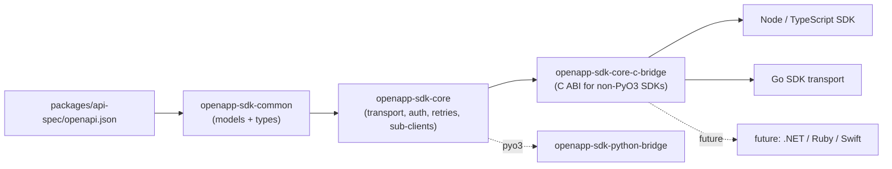

# `packages/sdk/core` architecture

The `packages/sdk/core` workspace is a single Rust implementation of *SDK behavior*
that every language binding reuses verbatim.

## Crates and dependency flow



### `openapp-sdk-common`

Low-level types and the generated REST client.

* Hand-written:
  * [`ApiErrorResponse`](crates/common/src/error.rs) — the JSON envelope that every
    non-2xx backend response carries.
  * [`ApiKey`](crates/common/src/token.rs) — parses `{base_url}_openapp_{secret}`
    tokens, mirroring [`apps/backend/local_server/src/api_key_store.rs`](../../apps/backend/local_server/src/api_key_store.rs).
* Generated:
  * [`generated.rs`](crates/common/src/generated.rs) is produced by running
    `just sdk::core::openapi-gen`, which invokes the `openapp-sdk-openapi-gen`
    binary with the `openapi-gen` feature on. Under the hood that binary runs
    [`progenitor`](https://github.com/oxidecomputer/progenitor) against the spec
    and rewrites the committed file. Drift is enforced by
    `just sdk::core::openapi-check`.

### `openapp-sdk-core`

The user-facing client. Cheap to clone (`Arc`-internally), fully async.

| Module                | What it owns                                                                  |
|-----------------------|-------------------------------------------------------------------------------|
| `auth`                | [`TokenProvider`] trait + `StaticApiKey` implementation.                      |
| `client`              | `ClientBuilder`, `Client`, per-tag sub-client factories.                      |
| `error`               | `SdkError`, with retry classification + status extraction.                    |
| `interceptor`         | `Interceptor` protocol + built-in `TracingInterceptor`.                       |
| `resources`           | Per-tag sub-clients; some tags still need wrapper coverage.                   |
| `retry`               | `RetryPolicy` (exponential backoff, deadlines).                               |
| `telemetry`           | `tracing_subscriber` bootstrap.                                               |
| `transport`           | The **only** place where requests are dispatched. Enforces auth + retries.    |

Every sub-client funnels through `Transport::request_json` so auth / retry / telemetry
live in exactly one place.

### `openapp-sdk-core-c-bridge`

Stable C ABI used by non-PyO3 SDKs (Node through `koffi`, Go through cgo, and
future .NET/Ruby/Swift bindings) to link against
`libopenapp_sdk_core_c_bridge`.

Current surface:

* Runtime/client lifecycle: `openapp_sdk_runtime_new/free`,
  `openapp_sdk_client_new/free`, and `openapp_sdk_client_new_with_config`.
* JSON requests: synchronous `openapp_sdk_client_request` plus
  `openapp_sdk_client_request_async` for callback-based runtimes.
* Raw-body requests: `openapp_sdk_client_request_raw` for generated clients that
  already encoded a request body and content type.
* Streaming: `openapp_sdk_client_request_stream_async` and
  `openapp_sdk_client_request_stream_async_with_headers` for SSE-like responses.
* Telemetry bootstrap: `openapp_sdk_telemetry_init`.
* Strings returned from the bridge: free with `openapp_sdk_string_free`.

Language bindings do not have to consume every bridge function immediately. For
example, Go uses the async/raw/streaming surface in its generated transport,
while Node currently uses the synchronous JSON call on a libuv worker thread.

## Invariants

1. **Single wire contract.** `packages/api-spec/openapi.json` is the only source
   of truth; Rust, Python, Node, and Go generated surfaces are derived from it.
   Drift is a hard build failure in pre-commit and CI.
2. **Thin language SDKs.** Any behavior a *customer* observes (retries, auth
   refresh, pagination, telemetry, error mapping) MUST live in `openapp-sdk-core`.
   Language wrappers may only add ergonomic sugar around it.
3. **Pluggable auth.** `TokenProvider` is the seam. Static API keys are the
   v1 impl; Ory Kratos session cookies and JWT come next — without breaking the
   client API.
4. **One HTTP policy layer.** Only `Transport` dispatches requests
   (`request_json`, raw JSON-body requests, multipart, and streaming variants).
   Interceptors observe; they never bypass the transport.
5. **Generic-first ergonomics.** Language SDKs should expose one future-proof
   primitive for entity actions (for example `entity.action(action_id, params)`)
   and may add a small alias layer (`open/close/on/off`) as sugar only. Alias
   helpers must forward to the generic primitive; they are never the complete
   surface.

## Why not pick something simpler?

<!-- markdownlint-disable MD013 MD060 -->

| Alternative                                          | Why we rejected it                                                                                    |
|------------------------------------------------------|-------------------------------------------------------------------------------------------------------|
| Hand-written Python HTTP client, no Rust core        | No reuse across future SDKs; duplicates auth / retry / telemetry.                                     |
| OpenAPI Generator's Python template                   | Poor typing; ties us to a maintainer-heavy Jinja template; no path to other SDKs.                     |
| Rust core inlined into the Python bridge crate       | Other language SDKs (.NET / Ruby / Go) could not reuse it.                                            |
| Protobuf + gRPC core                                  | Overkill for a REST product; adds proto + gRPC infra for zero wire-level gain.                         |

<!-- markdownlint-enable MD013 MD060 -->

## Build / test

Default recipes run in the Docker `sdk-core` service so contributors do not need
a host Rust toolchain:

```sh
just sdk core lint
just sdk core build
just sdk core test
just sdk core openapi-check
```

Host-only variants (`lint-host`, `build-host`, `test-host`,
`openapi-check-host`) exist for local iteration when Rust is installed.
