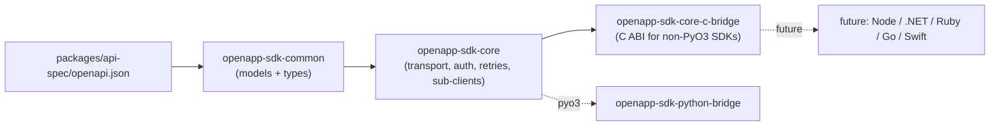

# `packages/sdk/core` architecture

The `packages/sdk/core` workspace is a single Rust implementation of *SDK behavior*
that every language binding reuses verbatim.

## Crates and dependency flow



### `openapp-sdk-common`

Low-level types and the generated REST client.

* Hand-written:
  * [`ApiErrorResponse`](crates/common/src/error.rs) — the JSON envelope that every
    non-2xx backend response carries.
  * [`ApiKey`](crates/common/src/token.rs) — parses `{base_url}_openapp_{secret}`
    tokens, mirroring [`apps/backend/local_server/src/api_key_store.rs`](../../apps/backend/local_server/src/api_key_store.rs).
* Generated:
  * [`generated.rs`](crates/common/src/generated.rs) is produced by running
    `just sdk::core::openapi-gen`, which invokes the `openapp-sdk-openapi-gen`
    binary with the `openapi-gen` feature on. Under the hood that binary runs
    [`progenitor`](https://github.com/oxidecomputer/progenitor) against the spec
    and rewrites the committed file. Drift is enforced by
    `just sdk::core::openapi-check`.

### `openapp-sdk-core`

The user-facing client. Cheap to clone (`Arc`-internally), fully async.

| Module                | What it owns                                                                  |
|-----------------------|-------------------------------------------------------------------------------|
| `auth`                | [`TokenProvider`] trait + `StaticApiKey` implementation.                      |
| `client`              | `ClientBuilder`, `Client`, per-tag sub-client factories.                      |
| `error`               | `SdkError`, with retry classification + status extraction.                    |
| `interceptor`         | `Interceptor` protocol + built-in `TracingInterceptor`.                       |
| `resources`           | One sub-client per OpenAPI tag (`OrgsClient`, `DevicesClient`, …).            |
| `retry`               | `RetryPolicy` (exponential backoff, deadlines).                               |
| `telemetry`           | `tracing_subscriber` bootstrap.                                               |
| `transport`           | The **only** place where requests are dispatched. Enforces auth + retries.    |

Every sub-client funnels through `Transport::request_json` so auth / retry / telemetry
live in exactly one place.

### `openapp-sdk-core-c-bridge`

Minimal C ABI, enough to prove the architecture and let a future non-PyO3 SDK
(think .NET or Ruby or Go) link against a single `libopenapp_sdk_core_c_bridge`.

* v1 surface: `openapp_sdk_runtime_new/free`, `openapp_sdk_client_new/free`,
  `openapp_sdk_client_request` (synchronous), `openapp_sdk_string_free`.
* Planned v2 surface:
  1. Async completion callbacks `(status, payload, user_data)`.
  2. Streaming hooks for `Public Access` session updates (WebRTC signalling is
     out of scope; event-stream polling is in scope).
  3. Telemetry plumbing (pass a handle into a Rust-side OTel pipeline).

## Invariants

1. **Single wire contract.** `packages/api-spec/openapi.json` is the only source
   of truth; Rust and Python models are both generated from it. Drift is a
   hard build failure in pre-commit and CI.
2. **Thin language SDKs.** Any behavior a *customer* observes (retries, auth
   refresh, pagination, telemetry, error mapping) MUST live in `openapp-sdk-core`.
   Language wrappers may only add ergonomic sugar around it.
3. **Pluggable auth.** `TokenProvider` is the seam. Static API keys are the
   v1 impl; Ory Kratos session cookies and JWT come next — without breaking the
   client API.
4. **One HTTP call site.** Only `Transport::request_json` makes actual requests.
   Interceptors observe; they never bypass the transport.
5. **Generic-first ergonomics.** Language SDKs should expose one future-proof
   primitive for entity actions (for example `entity.action(action_id, params)`)
   and may add a small alias layer (`open/close/on/off`) as sugar only. Alias
   helpers must forward to the generic primitive; they are never the complete
   surface.

## Why not pick something simpler?

<!-- markdownlint-disable MD013 MD060 -->

| Alternative                                          | Why we rejected it                                                                                    |
|------------------------------------------------------|-------------------------------------------------------------------------------------------------------|
| Hand-written Python HTTP client, no Rust core        | No reuse across future SDKs; duplicates auth / retry / telemetry.                                     |
| OpenAPI Generator's Python template                   | Poor typing; ties us to a maintainer-heavy Jinja template; no path to other SDKs.                     |
| Rust core inlined into the Python bridge crate       | Other language SDKs (.NET / Ruby / Go) could not reuse it.                                            |
| Protobuf + gRPC core                                  | Overkill for a REST product; adds proto + gRPC infra for zero wire-level gain.                         |

<!-- markdownlint-enable MD013 MD060 -->

## Build / test

```sh
cd packages/sdk/core
cargo fmt --all
cargo clippy --workspace --all-targets --all-features -- -D warnings
cargo test --workspace

# Regenerate the committed client from the latest OpenAPI spec.
just sdk::core::openapi-gen

# Drift check (CI / pre-commit).
just sdk::core::openapi-check
```
